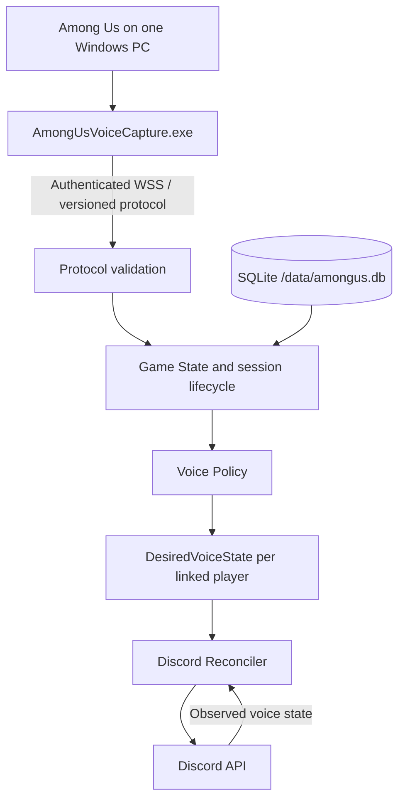

# Architecture

## Baseline versus target

Phase 1 imports the existing applications without restructuring them.
The bot is the Go 1.27 module
`github.com/Tabsi1998/Among-Us-Voice-Controller-AUVC/bot` and still
retains its public-service, Redis, PostgreSQL and premium integrations.
Capture still uses .NET 5 and its upstream transports and memory detection.
This document describes the intended AUVC architecture, not working AUVC features.

## Target data flow

Only the capture host needs additional software. Other players need neither
mods nor capture installations. The self-hosted bot should require no Galactus,
Redis, PostgreSQL, premium infrastructure, public workers or unnecessary sharding.

## Boundaries

- **Capture:** read game phase and players; retain comparable upstream
  memory/offset logic; send snapshots, events and heartbeats.
- **Protocol:** versioned envelopes and validation, authenticated session ownership,
  explicit compatibility errors, ordering and reconnect snapshot contract.
- **Game State:** authoritative session phase, player identity, alive/dead state and
  persistent Discord links. No direct Discord API calls from game event handlers.
  `bot/pkg/session` holds this projection as plain values with no discordgo,
  Redis or storage types in reach; `(*GameState).SessionState()` is the single
  seam that produces it. Unlinked users and Discord bot accounts are marked as
  unmanaged there, so nothing downstream can act on them by accident.
- **Voice Policy:** pure mapping from game state and guild configuration to
  `DesiredVoiceState { TargetChannelID, Muted, Deafened }`. Implemented in
  `bot/pkg/voice`, which imports neither discordgo nor the storage layer, so the
  ghost-chat table is tested cell by cell. Unmanaged players are absent from the
  result rather than filtered later: a player who is not in the map cannot be
  moved by mistake.
- **Discord Reconciler:** compare observed and desired states and apply only
  differences. Serialize guild/session work, reject stale work and respect rate
  limits. Handle asynchronous voice events without move loops or duplicate actions.
- **Persistence:** versioned SQLite migrations for guild settings, links and
  credential metadata. Preserve configuration through process restarts.
- **Commands/doctor:** typed Discord options, authorization and human-readable
  diagnostics, operating through application services.

## Safety and recovery

Manage only explicitly linked human players by default. Do not manipulate music
bots, unlinked users or disconnected members unexpectedly. Channel enforcement
is enabled by default with a configurable administrator override.

With the default `ghost-chat` preset, living players are muted/deafened during
tasks; ghosts remain open in their own channel during tasks, discussion and
voting. End of game returns managed players to the main channel open.

A lost capture heartbeat pauses the session and reconciles managed players to
unmuted/undeafened (optionally returning them to main), then sends a warning.
Reconnect requires a full validated snapshot before incremental events resume.
Process restarts must restore persistent settings/links and reconcile after the
snapshot, rather than trusting cached Discord state or missing events.

Specific queue, retry, sequence-reset and identity semantics require protocol
and recovery tests in their corresponding phases. Do not claim crash safety
until fault-injection and live Discord acceptance tests demonstrate it.
