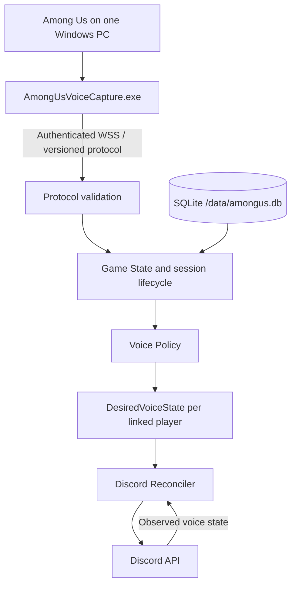

# Architecture

## Baseline versus target

The bot is the Go 1.27 module
`github.com/Tabsi1998/Among-Us-Voice-Controller-AUVC/bot`. Public API, metrics,
worker, premium and sharding integrations have been removed. Legacy game/session
paths still require Galactus, Redis and PostgreSQL. SQLite-backed `/au` setup,
settings and links form the first independent runtime slice. Capture still uses
.NET 5 and its upstream transports and memory detection. The target flow below is
therefore only partially implemented.

## Target data flow

Only the capture host needs additional software. Other players need neither
mods nor capture installations. The self-hosted bot should require no Galactus,
Redis, PostgreSQL, premium infrastructure, public workers or unnecessary sharding.

## Boundaries

- **Capture:** read game phase and players; retain comparable upstream
  memory/offset logic; send snapshots, events and heartbeats.
- **Protocol:** versioned envelopes and validation, authenticated session ownership,
  explicit compatibility errors, ordering and reconnect snapshot contract.
  Defined in [protocol/README.md](../protocol/README.md) and implemented twice:
  `bot/pkg/protocol` receives, `capture/AUVC.Protocol` sends. Neither is the
  reference; both are tested against the shared fixtures in `protocol/fixtures`,
  so the two cannot drift apart without a test failing. The receiver is a pure
  state machine over messages with no transport and no clock, which is what lets
  a reconnect, a duplicate and a lost event be tested by replaying a sequence.
  A gap in the sequence costs the session its snapshot: applying the events that
  did arrive would leave the bot confidently wrong about who is alive.
- **Game State:** authoritative session phase, player identity, alive/dead state and
  persistent Discord links. No direct Discord API calls from game event handlers.
  `bot/pkg/session` holds this projection as plain values with no discordgo,
  Redis or storage types in reach; `(*GameState).SessionState()` is the single
  seam that produces it. Unlinked users and Discord bot accounts are marked as
  unmanaged there, so nothing downstream can act on them by accident.
- **Voice Policy:** pure mapping from game state and guild configuration to
  `DesiredVoiceState { TargetChannelID, Muted, Deafened }`. Implemented in
  `bot/pkg/voice`, which imports neither discordgo nor the storage layer, so the
  ghost-chat table is tested cell by cell. Unmanaged players are absent from the
  result rather than filtered later: a player who is not in the map cannot be
  moved by mistake.
- **Channel enforcement:** `enforce_channels` is on by default and is what
  returns a player who switched channels themselves: a living player who walks
  into the ghost channel goes back to main, and a dead one who walks into main
  goes back to ghost. An administrator turns it off with
  `/au settings ghosts enforce_channels:false`, which is the override the
  requirements call for. Off, the policy emits no channel for a living player
  and the reconciler leaves them where they are, while still muting and
  deafening them as the phase demands, so wandering is not a way to listen in.
  It does not switch ghost chat off with it — moving the dead into the ghost
  channel is what `auto_move_ghosts` governs — and it never suppresses the
  return to main at the end of a round, or ghosts would be stranded.
- **Discord Reconciler:** compare observed and desired states and apply only
  differences. Serialize guild/session work, reject stale work and respect rate
  limits. Handle asynchronous voice events without move loops or duplicate actions.
  `voice.Diff` produces the minimal edit per player and returns nothing once the
  observation already matches, which is what stops a move loop: the voice state
  update caused by our own move cannot trigger another one. `voice.Reconciler`
  serializes work per guild so two asynchronous observations of the same guild
  cannot race. An unset channel target is never sent, because Discord reads an
  empty channel id as a disconnect. Moves are applied before the living are
  relaxed: when a player dies as a meeting starts, undeafening the living
  first would let them hear a corpse still sitting in the main channel.
- **Permissions:** `bot/pkg/permission` reports which Discord permissions AUVC
  lacks and what each one breaks, from effective bitmasks with overwrites already
  applied. Checking up front turns a mid-round API failure per player into one
  sentence an administrator can act on. Administrator is honoured as granting
  everything, and an unconfigured channel is a setup question rather than a
  permission report.

- **Voice switch-over:** the game handlers call the policy and the reconciler
  through `(*Bot).reconcileVoice`, which reads the guild configuration, projects
  the session, releases the game state lock and only then talks to Discord.
  Holding that lock across an API call would block every other handler for the
  guild. A guild that is disabled or has not run `/au setup channels`, and a
  configuration that cannot be read at all, fall back to the legacy voice rules
  rather than leaving players muted with no way out; phase 14 removes that
  fallback together with the legacy settings. Changes go out over the primary
  session rather than the token provider, whose purpose is spreading rate limits
  across the several bot tokens of a hosted deployment.

- **Persistence:** versioned SQLite migrations for guild settings, links and
  credential metadata. Preserve configuration through process restarts.

- **Live session:** `session.Live` is the mutable session a capture stream
  drives, and `State` is what comes out of it for the voice policy. Keeping the
  mutation apart from the projection is what lets the policy stay a pure
  function over a value. A snapshot replaces the player set rather than merging
  into it, which is the whole reason snapshots exist: after a reconnect the bot
  cannot know which remembered players are still in the game, and keeping a
  stale one would mean managing the voice of somebody who left.

  `(*Bot).HandleCapture` applies protocol messages to it, resolves in-game names
  through the SQLite player links, and reconciles. That path reaches the same
  policy and reconciler as the legacy one without touching Redis: the session
  lives in this process, because a self-hosted bot is one process and a session
  that lives in it needs no external store to be found again. Work is
  serialized per guild, since a reconnect can overlap the tail of the previous
  connection.

- **No external services:** the bot talks to Discord, reads and writes one
  SQLite file, and listens for a capture connection. Redis, PostgreSQL, Galactus
  and the token provider are gone, and with them the game state store, the event
  queue, the distributed locks, the rate limiter and the per-guild settings in
  Redis. A self-hosted bot is one process: the session lives in it, the locks are
  mutexes, and the configuration is a file. Six direct Go dependencies remain.

- **Session control:** `/au session start|stop|pause|resume|status` decides
  whether the bot acts on what capture reports. Stopped and paused are
  deliberately different: stopping releases everyone, pausing leaves them
  exactly where they are and keeps following the game, so resuming acts on the
  round as it is then rather than as it was when the pause began. Stopping
  releases people through the ordinary voice policy with the phase forced to
  Menu, rather than through a second path that unmutes directly — the policy
  already knows what "between rounds" looks like, and a second implementation
  would be a second thing that can disagree. `auto_start` decides whether a
  connecting capture starts a session on its own; a guild that left it off has
  said it wants to decide, so a snapshot must not quietly take over.

- **Transport:** `bot/pkg/transport` carries the protocol over a WebSocket and
  decides nothing about it: `bot/pkg/protocol` owns the rules, and this layer
  moves bytes and closes connections that break them. That split is what let the
  protocol be tested without a socket and lets the transport be tested without a
  game. A credential passes through exactly one place, the authentication
  message, and is handed straight to the pairing service without ever being
  logged.

- **Capture client:** `capture/AUVC.Transport` builds and numbers the messages,
  runs the handshake and keeps the credential. The connection sits behind an
  `IMessageChannel` interface, so the handshake, a refusal and a reconnect are
  all testable without a socket. The credential is stored through the Windows
  Data Protection API rather than in a file capture could read back on its own.

- **Capture credentials:** `/au capture pair` issues a code that works once and
  expires after ten minutes; typing it into capture exchanges it for a
  long-lived credential. `bot/pkg/credential` decides what a secret is worth and
  `bot/pkg/pairing` ties that to storage. Only hashes are stored, so a secret
  cannot leak from a database file, a backup or a support bundle, and a capture
  install that loses its credential has to pair again — the intended cost of
  keeping no recoverable copy. A plain SHA-256 is used rather than a password
  hash because these are 256-bit random values with nothing to guess; pairing
  codes are short, which is exactly why they are single use and short-lived.
  `credential.Secret` redacts itself from fmt and encoding/json, so the
  requirement that credentials never appear in a log is enforced by the type
  rather than by everyone remembering. `/au capture revoke` withdraws every
  credential and cancels any outstanding code, because revoking one without the
  other would leave a way back in the administrator was not told about.
- **Commands/doctor:** typed Discord options, authorization and human-readable
  diagnostics, operating through application services.

## Safety and recovery

Manage only explicitly linked human players by default. Do not manipulate music
bots, unlinked users or disconnected members unexpectedly. Channel enforcement
is enabled by default with a configurable administrator override.

With the default `ghost-chat` preset, living players are muted/deafened during
tasks; ghosts remain open in their own channel during tasks, discussion and
voting. End of game returns managed players to the main channel open.

A lost capture heartbeat pauses the session and reconciles managed players to
unmuted/undeafened (optionally returning them to main), then sends a warning.
Reconnect requires a full validated snapshot before incremental events resume.
Process restarts must restore persistent settings/links and reconcile after the
snapshot, rather than trusting cached Discord state or missing events.

Specific queue, retry, sequence-reset and identity semantics require protocol
and recovery tests in their corresponding phases. Do not claim crash safety
until fault-injection and live Discord acceptance tests demonstrate it.
